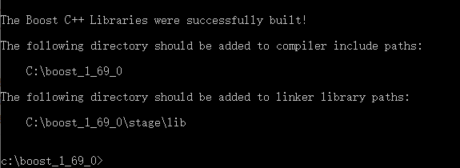

## 智能指针

所谓智能指针，指向动态申请的一块内存，在c++中则是使用`new`关键字申请的一块内存空间。

智能指针免去了人为的调用`delete`，以及使用不当造成的内存泄露的问题。智能指针则在适当的时候，释放指向的对象的内存空间，避免泄露。

简单的例子：

```c++
class Double
{
public:
	Double(double d = 0) : dValue(d) { cout << "constructor: " << dValue << endl; }
	~Double() { cout << "destructor: " << dValue << endl; }
	void setDouble(double d) { dValue = d; }
private:
	double dValue;
};

void main2()
{
	// 此时不会执行dou的析构函数，会造成内存泄漏
	// 需要显示的执行delete dou
	Double *dou = new Double(9.0);

	// delete dou;
}
// out2:
// constructor: 9

void main1()
{
	// auto_ptr会强制执行class的析构函数
	auto_ptr<Double> ptr(new Double(3.14));
	(*ptr).setDouble(6.28);
}
// out1:
// constructor: 9
// destructor: 6.28
```

### 标准库提供的智能指针

1. `auto_ptr`（已废弃），该指针使用时存在如下的问题：

```c++
	// 智能指针auto_ptr使用中的问题,auto_ptr已被弃用
	auto_ptr<int> p1(new int());
	cout << "p1:" << p1.get() << endl;
	auto_ptr<int> p2 = p1;
	cout << "p1:" << p1.get() << endl;
	cout << "p2:" << p2.get() << endl;

	// out:
	// p1:000001A287185F60
	// p1:0000000000000000
	// p2:000001A287185F60
```

2. `shared_ptr`

   允许多个`shared_ptr`指针指向同一个对象，使用引用计数的方式，当引用计数为0时，销毁对象。

   最安全的分配和使用动态内存的方法是调用一个名为`make_shared`的标准库函数：

   ```c++
   shared_ptr<string> pstr = make_shared<string>(这里填写某个构造函数的参数列表)
   ```

3. `unique_ptr`

4. `weak_ptr`

   弱引用，指向`shared_ptr`所管理的对象。

## boost的使用

```
>cd进入解压目录；

>bootstrap

>.\b2
```



完成后，注意控制台的提示，需要简单配置visual studio